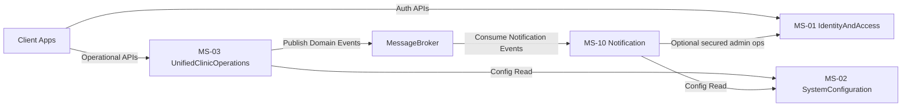
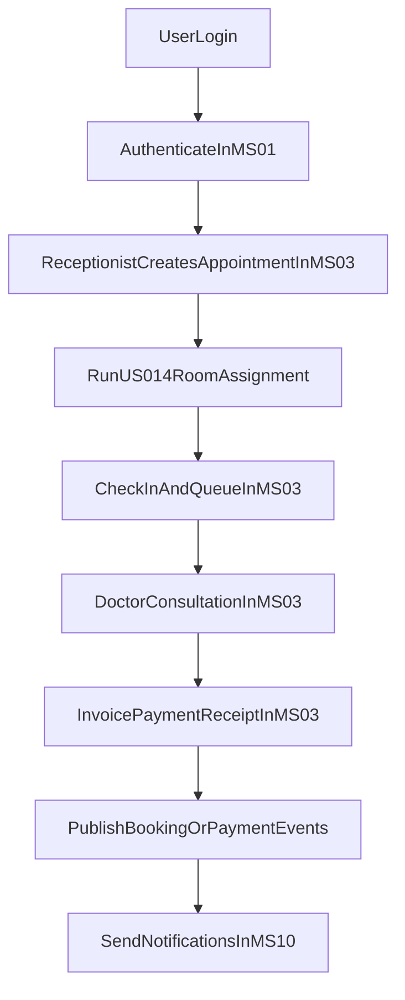

# Unified Clinic Service Architecture and Structure

## Final Service Set

- **MS-01 Identity & Access Service**
- **MS-02 System Configuration Service**
- **MS-03 Unified Clinic Operations Service**
- **MS-10 Notification Service**

## Full Responsibilities and Features

### MS-01 Identity & Access Service

**Responsibilities**
- User authentication and session lifecycle.
- JWT issuance/validation and token refresh.
- Central RBAC policy ownership and permission matrix management.
- Security policy enforcement baseline and audit trail of security events.

**Features**
- Login/logout and token refresh.
- Role and permission administration.
- Password/security policy controls.
- Security-focused audit events and access decision support.

### MS-02 System Configuration Service

**Responsibilities**
- Global clinic runtime settings management.
- Configuration distribution for scheduling, reminders, and business rules.

**Features**
- Working hours and consultation duration settings.
- Reminder timing and operational policy settings.
- Runtime-read configuration access for MS-03 and MS-10.

### MS-03 Unified Clinic Operations Service

**Responsibilities**
- End-to-end clinic business domain in one service:
  - Setup and master data (`US-001..US-007` operational setup parts).
  - Patient and appointment lifecycle (`US-008..US-015`).
  - Check-in and queue workflow (`US-016..US-019`).
  - Consultation lifecycle (`US-020..US-026`).
  - Medical records and attachments (`US-027..US-028`).
  - Billing and payments (`US-029..US-033`).
  - Reporting and dashboard generation (`US-038..US-041`).
- Publication of business domain events consumed by MS-10.

**Features**
- Canonical room assignment (fixed-room first, department LRU fallback, then unassigned+alert).
- Atomic booking and concurrency-safe slot/room reservation.
- Consultation completion with atomic persistence of diagnosis/prescription/notes/follow-up.
- Invoice creation, totals, payment recording, and receipt generation.
- Built-in reporting views for patient/revenue/doctor/room metrics.

### MS-10 Notification Service

**Responsibilities**
- Asynchronous notification orchestration and delivery.
- Template-based, channel-aware messaging with retries and deduplication.

**Features**
- Booking confirmation, reminder, cancellation, and payment notifications.
- Email/SMS/in-app channel dispatch pipeline.
- Retry/backoff, delivery logs, and idempotent send rules.

## Service Communication Model

- **Synchronous (REST)**
  - Client -> MS-01 for authentication.
  - Client -> MS-03 for all operational workflows.
  - MS-03/MS-10 -> MS-02 for runtime configuration reads.

- **Asynchronous (Domain Events via Broker)**
  - MS-03 -> MS-10 for booking/cancellation/payment/receipt-triggered notifications.
  - Delivery guarantees: at-least-once with consumer idempotency keys.

## Dependency Handling Strategy

- **Ordering**
  - MS-01 and MS-02 are prerequisite services.
  - MS-03 depends on MS-01 (authn/authz) and MS-02 (runtime settings).
  - MS-10 depends on MS-01 (secured ops), MS-02 (notification rules), and MS-03 events.

- **Failure handling**
  - Business transactions in MS-03 remain independent of notification dispatch.
  - Notification failures do not roll back appointments or payments.
  - Retry with bounded backoff and dead-letter queue for poison messages.

- **Consistency model**
  - Strong consistency inside MS-03 transactional boundaries.
  - Eventual consistency between MS-03 and MS-10.
  - Outbox pattern for reliable event publishing from MS-03.

## Service Architecture Graph

## User Workflow Graph

## Story-to-Service Coverage Snapshot

- **MS-01:** `US-042..US-045`, RBAC source-of-truth for `US-006`.
- **MS-02:** `US-007`.
- **MS-03:** `US-001..US-041` (including merged consultation, medical records, billing, and reporting capabilities).
- **MS-10:** `US-034..US-037` as notification delivery and orchestration.
