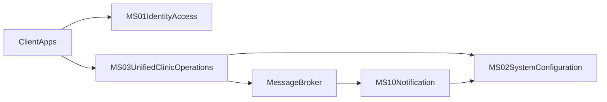
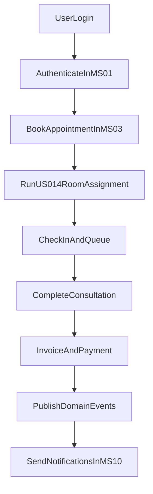

# Service Interactions

## Services
- `MS-01 Identity & Access`
- `MS-02 System Configuration`
- `MS-03 Unified Clinic Operations`
- `MS-10 Notification`

## Communication Pattern
- **Synchronous REST**
  - Client apps authenticate through `MS-01`.
  - Client apps execute core workflows through `MS-03`.
  - `MS-03` and `MS-10` read runtime settings from `MS-02`.
- **Asynchronous Events**
  - `MS-03` publishes booking/cancellation/payment/receipt events to message broker.
  - `MS-10` consumes events and dispatches notifications.

## Dependency Handling
- Startup dependency order:
  1. `MS-01`, `MS-02`
  2. `MS-03`
  3. `MS-10`
- Failure behavior:
  - `MS-03` business transactions do not block on `MS-10`.
  - Notification delivery retries with bounded backoff.
  - At-least-once delivery requires idempotent consumers.

## Service Architecture Graph

## User Workflow Graph

